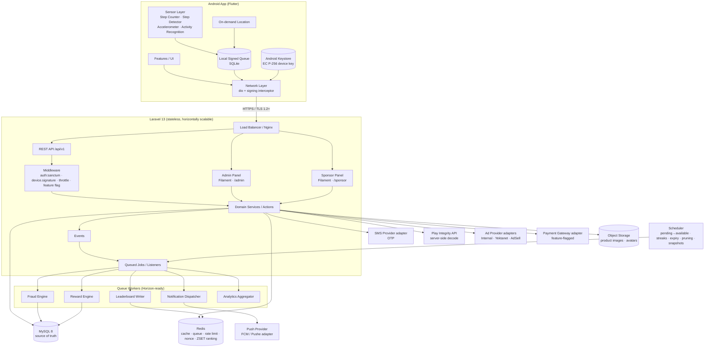

# ۱. معماری کلان

## ۱.۱ Architecture Diagram



## ۱.۲ اصول غیرقابل مذاکره

1. **Server is the source of truth.** Client فقط «مشاهده» (observation) ارسال می‌کند؛ هیچ‌گاه «نتیجه» (Reward، Balance، Verified Steps) ارسال نمی‌کند.
2. **هیچ Point بدون Ledger.** جدول `wallets` فقط cache موجودی است و تنها داخل همان Transaction دیتابیسی که ردیف `point_transactions` را درج می‌کند تغییر می‌کند.
3. **Idempotency در همه عملیات مالی.** هر Reward کلید یکتای `(user_id, idempotency_key)` دارد؛ درخواست تکراری همان نتیجه قبلی را برمی‌گرداند و ردیف جدید نمی‌سازد.
4. **Business Rule در Database/Settings، نه در کد.** نرخ‌ها، سقف‌ها، آستانه‌های Fraud و Feature Flagها از Admin قابل تغییرند؛ کد فقط مقدار پیش‌فرض امن دارد.
5. **حداقل‌سازی داده.** Location فقط در Featureهای مکانی، داده خام سنسور هرگز به سرور ارسال نمی‌شود (فقط خلاصه دقیقه‌ای)، و خلاصه‌ها Retention دارند.
6. **Fail closed برای پول، fail open برای تجربه.** اگر Fraud Engine در دسترس نباشد، Reward در وضعیت `pending` می‌ماند (نه `available`)؛ اما شمارش قدم و UI کاربر هرگز متوقف نمی‌شود.

## ۱.۳ انتخاب‌های فنی

| لایه | انتخاب | دلیل |
|------|--------|------|
| Backend | Laravel 13 / PHP 8.4 | مطابق Spec؛ Queue، Scheduler، Notification و Policy بومی |
| Auth API | Laravel Sanctum (Personal Access Token) | Token ساده و قابل ابطال per-device؛ نیازی به OAuth کامل نیست. هر Token به یک `device_id` گره می‌خورد |
| Admin / Sponsor Panel | Filament 5 (دو Panel مستقل) | RTL و فارسی بومی، Policy-aware، سرعت توسعه بالا؛ پنل‌ها روی همان Domain Service ها کار می‌کنند و Business Logic تکراری نمی‌شود |
| DB | MySQL 8 (InnoDB, utf8mb4) | Row locking (`SELECT … FOR UPDATE`) برای Ledger، JSON و Generated Column در صورت نیاز |
| Cache/Queue | Redis | Rate limit، Nonce store، ZSET برای Leaderboard، Queue |
| Mobile | Flutter 3.47 / Dart 3.13 | مطابق Spec |
| State Management | Riverpod 3 | یکپارچه، قابل تست، بدون وابستگی به BuildContext؛ بدون codegen برای سادگی build |
| Routing | go_router | Deep link (QR، Push)، ShellRoute برای Bottom Nav |
| Network | dio + Interceptor امضا | Retry، Timeout، Error mapping متمرکز |
| Local DB | sqflite | صف آفلاین و cache سبک؛ بدون codegen |
| Secure Storage | flutter_secure_storage + Android Keystore (Platform Channel) | کلید خصوصی دستگاه هرگز از Keystore خارج نمی‌شود |
| تقویم | Jalali (shamsi_date) | نمایش تاریخ شمسی؛ ذخیره همیشه UTC |

## ۱.۴ انحراف‌های آگاهانه از Specification (بند ۷۶)

این موارد در Spec وجود دارند اما اجرای «کلمه‌به‌کلمه» آن‌ها از نظر امنیت، محدودیت Android یا حریم خصوصی مشکل دارد. راهکار جایگزین اجرا می‌شود:

### الف) «تشخیص Root / Emulator / Tampering» در Client
- **مشکل:** هر بررسی سمت Client (فایل `su`، Build props) با Frida/Magisk قابل دور زدن است. اتکا به آن امنیت کاذب می‌سازد.
- **راهکار:** استفاده از **Google Play Integrity API** با **Decode سمت سرور** (نه Client). نتیجه‌ی `deviceIntegrity`، `appIntegrity` و `accountDetails` فقط یک **سیگنال** در Fraud Engine است. بررسی‌های محلی (mock location flag، emulator heuristics) هم ارسال می‌شوند ولی وزن پایین دارند.
- **محدودیت ایران:** بخشی از کاربران ممکن است Google Play Services نداشته باشند یا به آن دسترسی پایدار نداشته باشند. نبودِ Integrity token **به‌تنهایی** باعث رد Reward نمی‌شود؛ فقط Confidence را کم و سقف روزانه Reward را برای آن دستگاه محدود می‌کند (قابل تنظیم در Admin).

### ب) «Verified Steps»
- **مشکل:** سرور نمی‌تواند قدم را «ببیند». هر عددی که Client بفرستد قابل جعل است، حتی با امضا (مهاجم می‌تواند اپ را اجرا و سنسور را شبیه‌سازی کند).
- **راهکار:** Verified Steps = خروجی **Plausibility Model سمت سرور** روی **خلاصه‌های دقیقه‌ای امضاشده**: سازگاری Step Counter و Step Detector، Cadence (قدم/دقیقه) در محدوده انسانی، واریانس شتاب‌سنج متناسب با راه‌رفتن، Activity Recognition، پیوستگی زمانی، سقف‌های فیزیولوژیک و سیگنال‌های Device/Account. قدم‌های مشکوک **حذف جزئی** می‌شوند (نه کل Session). سیستم ادعای «تقلب غیرممکن» نمی‌کند؛ هدف این است که تقلب **گران‌تر از سود آن** باشد.

### ج) Background Tracking
- **مشکل:** Foreground Service دائمی برای شمارش قدم، باتری را مصرف می‌کند و از Android 14 به بعد نوع سرویس (`health`) و مجوز جداگانه لازم دارد؛ برخی OEMها (Xiaomi، Huawei، Samsung) آن را kill می‌کنند.
- **راهکار:** `TYPE_STEP_COUNTER` سنسور سخت‌افزاری کم‌مصرف است و **خودش در پس‌زمینه می‌شمارد** (از زمان boot). اپ با **WorkManager** (حداقل هر ۱۵ دقیقه) مقدار را می‌خواند و delta ثبت می‌کند. Foreground Service فقط برای **Walking Session فعال** که کاربر خودش شروع کرده (با Notification دائمی و GPS اختیاری). جزئیات در [tracking-offline.md](07-tracking-offline.md).

### د) Rewarded Ads
- **مشکل:** Client نمی‌تواند اثبات کند تبلیغ دیده شده. Spec هم همین را می‌گوید.
- **راهکار:** Reward فقط از **Server-to-Server callback** امضاشده‌ی Provider صادر می‌شود. اگر Provider (Yektanet/AdSell) چنین Callbackی نداشته باشد، Rewarded Ad برای آن Provider **غیرفعال** است (Feature Flag). برای Internal Ads، سرور یک `view_token` یک‌بارمصرف با حداقل زمان نمایش صادر می‌کند؛ این روش ضعیف‌تر است و سقف Reward روزانه پایین‌تری دارد. پیش از Phase 6 مستندات رسمی نسخه فعلی SDKها بررسی و نتیجه در `docs/phase-6` ثبت می‌شود.

### ه) QR ثابت
- **مشکل:** QR چاپی با Screenshot در گروه‌های تلگرامی پخش می‌شود.
- **راهکار:** سه حالت: (۱) **Rotating QR** روی صفحه‌ای که Sponsor در شعبه باز می‌کند (Token با HMAC و پنجره ۳۰ ثانیه)، (۲) QR چاپی **فقط در ترکیب با** Geofence + Minimum Stay، (۳) Server Validation نهایی. QR چاپی هرگز به‌تنهایی Reward نمی‌دهد.

### و) Pending Points
- **افزوده:** Spec «Pending points» را در Wallet نام می‌برد اما چرخه آن را تعریف نمی‌کند. هر Reward ابتدا `pending` است و پس از **Hold Window** (پیش‌فرض ۲۴ ساعت، قابل تنظیم) و عبور از تحلیل Fraud تأخیری (Cross-session / Multi-account) به `available` تبدیل می‌شود. این مهم‌ترین ابزار ضدتقلب اقتصادی است: مهاجم قبل از خرج کردن Point شناسایی می‌شود.

### ز) ذخیره داده حجیم سنسور
- Client هرگز Sample خام ۵۰Hz ارسال نمی‌کند. واحد ارسال **Minute Bucket** است (قدم، cadence، آمار شتاب: mean/std/peak frequency، activity type، کیفیت GPS خلاصه). Bucketها در `activity_samples` با Retention پیش‌فرض ۳۰ روز نگه داشته و سپس Prune می‌شوند؛ `walking_sessions` و `daily_activities` دائمی‌اند.

### ح) Timezone و Streak
- Timezone کاربر هنگام ثبت‌نام از دستگاه گرفته و در `users.timezone` ذخیره می‌شود. تغییر آن حداکثر یک بار در ۷ روز پذیرفته می‌شود (ضد Timezone-hopping برای دوبار گرفتن Daily Bonus). مرز «روز» همیشه با این timezone سمت سرور محاسبه می‌شود.

### ط) پرداخت پولی
- در نسخه اول پشت Feature Flag `store.money_payment`. Adapter برای درگاه‌های داخلی (Zarinpal/IDPay…) در Phase 7 طراحی می‌شود؛ مبالغ ریالی در ستون‌های `BIGINT` جداگانه، هرگز در کنار Point.

## ۱.۵ Domainها

```
Auth · User · Device · Activity · Fraud · Reward · Wallet · Gamification
Health · Sponsor · Advertising · Store · Order · Notification · Support
Content(CMS) · Analytics · Admin · Settings
```

مرز Domainها: هر Domain Model، Service/Action، Event و Policy خودش را دارد. Domainها از طریق **Service عمومی** یا **Event** با هم حرف می‌زنند، نه با دسترسی مستقیم به جدول‌های یکدیگر. مثال: Activity پس از بسته شدن Session رویداد `WalkingSessionSubmitted` را منتشر می‌کند؛ Fraud آن را امتیاز می‌دهد و `WalkingSessionScored` منتشر می‌کند؛ Reward روی آن Reward صادر می‌کند و از `WalletService::credit()` استفاده می‌کند.

## ۱.۶ Scalability

- Backend stateless؛ Session در Redis؛ فایل‌ها در Object Storage.
- کارهای سنگین (Fraud، Reward انبوه، Leaderboard، Notification، Analytics) در Queue با صف‌های جدا: `critical` (ledger)، `default`، `fraud`، `notifications`، `analytics`.
- Leaderboard: Redis ZSET per period (`lb:steps:day:2026-09-24`) با `ZINCRBY` پس از تأیید Session؛ Snapshot پایان دوره در MySQL.
- `analytics_events` جدول append-only با Partition ماهانه در Production (Phase 9) و Aggregation شبانه به `analytics_daily`.
- Home: یک Endpoint تجمیعی `GET /api/v1/home` با Cache کوتاه per-user.
