# ۲. ERD و طراحی جدول‌ها

قراردادهای عمومی:

- موتور InnoDB، charset `utf8mb4_unicode_ci`، همه زمان‌ها **UTC** (`TIMESTAMP`/`DATETIME`) و `local_date` جداگانه برای روز کاربر.
- کلید اصلی `BIGINT UNSIGNED AUTO_INCREMENT`. برای شناسه‌هایی که به Client می‌رسند ستون `public_id CHAR(26)` (ULID) با Unique Index؛ **ID عددی هرگز در API منتشر نمی‌شود** (جلوگیری از Enumeration).
- Point و ریال همیشه `BIGINT` (عدد صحیح)؛ هیچ Float در مبالغ.
- Status‌ها `VARCHAR(32)` با PHP Backed Enum (انعطاف‌پذیرتر از MySQL ENUM در Migration).
- JSON فقط برای داده نیمه‌ساختاریافته‌ای که روی آن Query/Join نمی‌شود (خلاصه GPS، پارامتر Rule، Snapshot محصول).
- Soft delete فقط برای `users`، `products`، `sponsors`، `locations`. جدول‌های مالی و Audit هرگز حذف نمی‌شوند.

## ۲.۱ نمای کلی روابط

```mermaid
erDiagram
    users ||--|| user_profiles : has
    users ||--|| wallets : owns
    users ||--o{ point_transactions : ledger
    users ||--o{ device_user_links : uses
    devices ||--o{ device_user_links : "used by"
    users ||--o{ walking_sessions : walks
    devices ||--o{ walking_sessions : records
    walking_sessions ||--o{ activity_samples : "minute buckets"
    users ||--o{ daily_activities : "per local day"
    walking_sessions ||--o{ fraud_events : signals
    fraud_rules ||--o{ fraud_events : triggers
    users ||--o{ fraud_cases : reviewed
    walking_sessions ||--o| rewards : produces
    rewards ||--|| point_transactions : "settled by"
    reward_rules ||--o{ rewards : "applied in"
    users ||--o{ user_achievements : unlocks
    achievements ||--o{ user_achievements : ""
    challenges ||--o{ challenge_participants : ""
    users ||--o{ challenge_participants : joins
    sponsors ||--o{ sponsor_users : staff
    sponsors ||--o{ locations : owns
    sponsors ||--o{ campaigns : runs
    campaigns ||--o{ campaign_locations : ""
    locations ||--o{ campaign_locations : ""
    campaigns ||--o{ visits : ""
    users ||--o{ visits : makes
    sponsors ||--o{ coupons : issues
    coupons ||--o{ user_coupons : ""
    users ||--o{ user_coupons : holds
    ad_campaigns ||--o{ ads : creatives
    ad_placements ||--o{ ad_events : ""
    ads ||--o{ ad_events : ""
    categories ||--o{ products : ""
    products ||--o{ order_items : ""
    orders ||--o{ order_items : ""
    users ||--o{ orders : places
    users ||--o{ addresses : ""
    users ||--o{ referrals : refers
    users ||--o{ support_tickets : opens
    support_tickets ||--o{ support_messages : ""
```

## ۲.۲ جدول‌ها

علامت‌ها: **PK** کلید اصلی، **FK** کلید خارجی، **UQ** یکتا، **IX** ایندکس.

### Identity & Access

#### `users`
| ستون | نوع | توضیح |
|------|-----|-------|
| id | PK | |
| public_id | CHAR(26) UQ | ULID |
| phone | VARCHAR(20) UQ | E.164 (`+989121234567`) |
| phone_verified_at | TIMESTAMP NULL | |
| display_name | VARCHAR(50) NULL | نام نمایشی عمومی |
| avatar_path | VARCHAR NULL | |
| status | VARCHAR(32) IX | `active, suspended, banned, deleted` |
| status_reason | VARCHAR NULL | |
| referral_code | VARCHAR(12) UQ | |
| referred_by_id | FK users NULL | |
| timezone | VARCHAR(64) | پیش‌فرض `Asia/Tehran` |
| timezone_changed_at | TIMESTAMP NULL | Rate limit تغییر |
| locale | VARCHAR(8) | `fa` |
| level | SMALLINT | cache از XP |
| xp | BIGINT | cache از `xp_transactions` |
| leaderboard_visible | BOOL | کنترل حریم خصوصی |
| last_active_at | TIMESTAMP IX | DAU/MAU |
| deletion_requested_at | TIMESTAMP NULL | |
| timestamps, deleted_at | | |

#### `user_profiles`
`user_id` (PK, FK) · `birth_year SMALLINT NULL` · `gender VARCHAR NULL` (اختیاری) · `height_cm SMALLINT NULL` · `weight_kg DECIMAL(5,1) NULL` · `daily_step_goal INT` · `water_goal_ml INT` · `water_reminder_enabled BOOL` · `water_reminder_interval_min SMALLINT` · `quiet_hours_start TIME NULL` · `quiet_hours_end TIME NULL` · timestamps

> سن فقط به‌صورت `birth_year` ذخیره می‌شود (حداقل‌سازی داده؛ برای کالری کافی است).

#### `notification_preferences`
`id` · `user_id` FK · `category VARCHAR(32)` · `push_enabled BOOL` · timestamps — **UQ(user_id, category)**

#### `otp_codes`
`id` · `phone` IX · `code_hash CHAR(64)` (HMAC-SHA256، هرگز Plain) · `purpose` (`login`) · `attempts TINYINT` · `expires_at` · `consumed_at NULL` · `ip_hash` · `created_at` — **IX(phone, created_at)**. Prune روزانه.

#### `devices`
| ستون | نوع | توضیح |
|------|-----|-------|
| id | PK | |
| public_id | CHAR(26) UQ | همان `X-Device-Id` |
| install_id | CHAR(36) UQ | UUID تولید Client در اولین اجرا |
| platform | VARCHAR(16) | `android`, `ios` |
| os_version, app_version, model, manufacturer | VARCHAR | غیرحساس |
| public_key | TEXT | کلید عمومی EC P-256 (PEM) از Keystore |
| key_attested | BOOL | Key attestation معتبر |
| integrity_verdict | VARCHAR(32) NULL | `strong, device, basic, none, unavailable` |
| integrity_checked_at | TIMESTAMP NULL | |
| emulator_suspected, root_suspected | BOOL | سیگنال Client (وزن کم) |
| trust_score | TINYINT | ۰..۱۰۰ محاسبه سرور |
| status | VARCHAR(32) IX | `active, blocked, revoked` |
| push_provider, push_token | VARCHAR NULL | |
| last_sequence | BIGINT | آخرین sequence پذیرفته‌شده Session |
| last_seen_at, last_ip_hash | | |
| timestamps | | |

#### `device_user_links`
`id` · `device_id` FK · `user_id` FK · `first_seen_at` · `last_seen_at` — **UQ(device_id, user_id)**، **IX(user_id)**. پایه تشخیص «چند حساب روی یک دستگاه» و «چند دستگاه برای یک حساب».

#### `personal_access_tokens` (Sanctum + ستون افزوده)
ستون افزوده `device_id` FK — **هر Token فقط با همان دستگاهی که برایش صادر شده معتبر است.**

#### `admins` / `sponsor_users`
حساب‌های وب جدا از کاربران اپ (Guard جدا).
- `admins`: `id, name, email UQ, password, role VARCHAR IX, is_active, two_factor_secret NULL (encrypted), last_login_at, timestamps`
- `sponsor_users`: `id, sponsor_id FK, name, email UQ, phone, password, role (owner, manager, analyst, cashier), is_active, last_login_at, timestamps`

### Activity

#### `walking_sessions`
| ستون | نوع | توضیح |
|------|-----|-------|
| id, public_id | PK / UQ | |
| user_id | FK IX | |
| device_id | FK | |
| client_session_id | CHAR(36) | **UQ(device_id, client_session_id)** — ضد تکرار |
| sequence | BIGINT | **UQ(device_id, sequence)** — ترتیب یکنواخت per device |
| kind | VARCHAR(16) | `passive` (پنجره پس‌زمینه) · `active` (کاربر شروع کرده) |
| started_at, ended_at | DATETIME | |
| local_date | DATE | روز کاربر به timezone معتبر |
| raw_steps | INT | ادعای Client |
| verified_steps | INT | خروجی Fraud Engine |
| distance_m | INT | |
| duration_s, active_duration_s | INT | |
| calories_kcal | DECIMAL(7,1) | تخمینی سرور |
| activity_type | VARCHAR(16) | `walking, running, mixed, vehicle, unknown` |
| overlap_s | INT | همپوشانی زمانی با Sessionهای دیگر همین کاربر |
| gps_summary | JSON NULL | تعداد نقطه، دقت میانگین، max speed، jumps — فقط Session فعال |
| motion_summary | JSON | cadence mean/p95، accel std، نسبت detector/counter |
| confidence_score | TINYINT NULL | ۰..۱۰۰ |
| fraud_score | TINYINT NULL IX | ۰..۱۰۰ |
| rule_set_version | INT NULL | نسخه Ruleها هنگام امتیازدهی |
| status | VARCHAR(32) IX | `submitted, verified, partially_verified, under_review, rejected` |
| reward_status | VARCHAR(32) | `none, pending, rewarded, denied` |
| scored_at | TIMESTAMP NULL | |
| timestamps | | |

IX: `(user_id, local_date)`, `(user_id, started_at)`, `(status, created_at)`.

#### `activity_samples` (Buckets، Retention = ۳۰ روز)
یک Bucket یک دقیقه در Session فعال، یا یک پنجره پس‌زمینه (حداکثر ۶۰ دقیقه) در Session Passive است.
`id` · `walking_session_id` FK cascade · `started_at DATETIME` · `duration_s SMALLINT` · `steps SMALLINT` · `detector_steps SMALLINT NULL` · `accel_std DECIMAL(6,3) NULL` · `accel_peak_hz DECIMAL(4,2) NULL` · `activity_type NULL` · `activity_confidence TINYINT NULL` · `speed_mps DECIMAL(5,2) NULL` · `gps_accuracy_m SMALLINT NULL` — **UQ(walking_session_id, started_at)**، **IX(started_at)** برای Prune

#### `daily_activities`
`id` · `user_id` FK · `local_date` · `raw_steps` · `verified_steps` · `distance_m` · `calories_kcal` · `active_minutes` · `goal_steps` (Snapshot هدف آن روز) · `goal_reached_at NULL` · `points_earned` · `rewarded_steps` · `sessions_count` · timestamps — **UQ(user_id, local_date)**، **IX(local_date, verified_steps)**

#### `water_logs`
`id` · `user_id` FK · `local_date` · `amount_ml SMALLINT` · `logged_at` · `created_at` — **IX(user_id, local_date)**

### Fraud

#### `fraud_rules`
`id` · `key VARCHAR UQ` (مثل `cadence_ceiling`) · `name` · `description` · `category` (`device, motion, gps, time, network, account`) · `is_enabled` · `weight SMALLINT` · `params JSON` (آستانه‌های قابل تنظیم) · `action` (`score, cap_steps, reject, review`) · `updated_by` FK admins · timestamps

#### `fraud_events`
`id` · `user_id` FK IX · `device_id` FK NULL · `subject_type, subject_id` (morph: session/visit/referral/ad) · `rule_key` IX · `score SMALLINT` · `severity` (`low, medium, high, critical`) · `details JSON` · `created_at` — **IX(user_id, created_at)**، **IX(rule_key, created_at)**

#### `fraud_cases`
`id` · `user_id` FK · `device_id` NULL · `subject_type, subject_id` NULL · `risk_score` · `status` IX (`open, approved, rejected, flagged, banned, safe`) · `reason` · `assigned_admin_id` NULL · `decided_by` NULL · `decided_at` NULL · `decision_note` · timestamps

### Reward & Wallet

#### `reward_rules`
| ستون | توضیح |
|------|-------|
| id, name | |
| rule_type | `step_rate, multiplier, daily_cap, weekly_cap, max_rewarded_steps, goal_bonus, streak_bonus` |
| priority | ترتیب اعمال |
| is_active | |
| starts_at, ends_at NULL | بازه اعتبار |
| days_of_week | VARCHAR(20) NULL — مثل `5,6` (جمعه=5 در Carbon) |
| start_time, end_time | TIME NULL — Bonus hours |
| steps, points | برای `step_rate` (۱۰۰۰ قدم = ۱۰ Point) و `goal_bonus` |
| multiplier | DECIMAL(4,2) |
| cap | INT — برای سقف‌ها |
| campaign_id / challenge_id | NULL — scope خاص |
| params | JSON NULL — مثل جدول Streak (`{"7":20,"30":100}`) |

#### `rewards`
توضیح شفاف «چرا این مقدار Point؟» برای کاربر و Admin.
`id, public_id` · `user_id` FK · `source_type, source_id` · `base_points` · `multiplier` · `bonus_points` · `capped_points` · `final_points` · `breakdown JSON` (قوانین اعمال‌شده) · `status` (`pending, granted, denied, reversed`) · `point_transaction_id` FK NULL · timestamps — **UQ(source_type, source_id, user_id)**

#### `wallets`
`user_id` PK/FK · `available_balance BIGINT` · `pending_balance BIGINT` · `lifetime_earned` · `lifetime_spent` · `lifetime_expired` · `updated_at` — `CHECK (available_balance >= 0 AND pending_balance >= 0)`

#### `point_transactions` (Ledger — فقط Insert و یک Transition وضعیت)
| ستون | توضیح |
|------|-------|
| id, public_id | |
| user_id | FK |
| type | `walking_reward, goal_bonus, streak_bonus, challenge_reward, sponsor_reward, referral_reward, ad_reward, achievement_reward, coupon_reward, purchase, refund, adjustment, expiration` |
| amount | BIGINT علامت‌دار (+ واریز، − برداشت) |
| status | `pending, completed, reversed` |
| balance_before, balance_after | موجودی **available** قبل و بعد (هنگام completed) |
| source_type, source_id | منبع (session, order, visit, admin…) |
| idempotency_key | **UQ(user_id, idempotency_key)** |
| description | فارسی، قابل نمایش |
| rial_rate | ریال به ازای هر Point در لحظه ثبت (Snapshot) |
| performed_by_type/id | Admin برای adjustment |
| reason | اجباری برای adjustment |
| available_at | زمان آزادسازی pending |
| completed_at, reversed_at | |
| created_at | |

IX: `(user_id, created_at)`, `(status, available_at)`, `(source_type, source_id)`, `(type, created_at)`.

#### `point_conversion_rates`
`id` · `rial_per_point BIGINT` · `effective_from` IX · `created_by` · `created_at` — نرخ جاری = آخرین `effective_from <= now`. تاریخچه هرگز ویرایش نمی‌شود.

### Gamification

- `levels`: `id, level UQ, min_xp, title` 
- `xp_transactions`: `id, user_id, amount, source_type, source_id, idempotency_key, created_at` — **UQ(user_id, idempotency_key)**
- `achievements`: `id, key UQ, name, description, icon, metric (total_steps, daily_steps, streak_days, total_distance_m, active_days, challenges_completed), threshold BIGINT, xp_reward, point_reward, is_active, sort`
- `user_achievements`: `id, user_id, achievement_id, unlocked_at` — **UQ(user_id, achievement_id)**
- `user_streaks`: `user_id PK, current_days, longest_days, last_goal_date DATE NULL, updated_at`
- `personal_records`: `id, user_id, metric (best_day_steps, best_week_steps, longest_session_m), value, local_date, achieved_at` — **UQ(user_id, metric)**

### Challenges & Leaderboard

- `challenges`: `id, public_id, title, description, image_path, type (steps, distance, daily, weekly, location, sponsored), metric, target_value, sponsor_id NULL, campaign_id NULL, reward_points, reward_coupon_id NULL, reward_multiplier NULL, max_participants NULL, participants_count, starts_at, ends_at, status (draft, pending_approval, scheduled, active, ended, cancelled), created_by_type/id, approved_by, timestamps` — **IX(status, starts_at)**
- `challenge_participants`: `id, challenge_id, user_id, progress BIGINT, joined_at, completed_at NULL, rewarded_at NULL` — **UQ(challenge_id, user_id)**, **IX(challenge_id, progress)**
- `leaderboard_snapshots`: `id, board (steps), period (day, week, month), period_key (2026-09-24 / 2026-W39 / 2026-09), user_id, rank, score, created_at` — **UQ(board, period, period_key, user_id)**, **IX(board, period, period_key, rank)**. رتبه زنده در Redis ZSET.

### Sponsor, Location, Campaign, Coupon

- `sponsors`: `id, public_id, name, legal_name, logo_path, description, contact_phone, contact_email, website, national_id, status (pending, approved, rejected, suspended), rejection_reason, approved_by, approved_at, point_budget BIGINT, points_spent BIGINT, timestamps, deleted_at`
- `locations`: `id, public_id, sponsor_id, name, address, city, latitude DECIMAL(10,7), longitude DECIMAL(10,7), radius_m SMALLINT, opening_hours JSON, qr_secret (encrypted), status (pending, approved, rejected, inactive), timestamps, deleted_at` — **IX(latitude, longitude)**، **IX(sponsor_id)**. در Production ستون Generated `POINT SRID 4326` + Spatial Index اضافه می‌شود.
- `campaigns`: `id, public_id, sponsor_id, name, description, type (location_visit, challenge, coupon, ad), verification_method (geofence, geofence_stay, geofence_qr, geofence_qr_server), min_stay_seconds, reward_points, reward_coupon_id NULL, max_rewards_per_user, daily_limit_per_user, total_limit, rewards_count, point_budget, points_spent, starts_at, ends_at, status (draft, pending_approval, approved, active, paused, ended, rejected), rejection_reason, approved_by, approved_at, timestamps` — **IX(status, starts_at, ends_at)**
- `campaign_locations`: **UQ(campaign_id, location_id)**
- `visits`: `id, public_id, user_id, device_id, campaign_id, location_id, status (started, present, qr_verified, verified, rewarded, rejected, expired), entered_at, last_ping_at, stay_seconds, pings_count, min_distance_m, best_accuracy_m, qr_nonce NULL UQ, qr_verified_at, fraud_score, rejection_reason, reward_id NULL, timestamps` — **IX(user_id, campaign_id, created_at)**
- `coupons`: `id, public_id, sponsor_id NULL, campaign_id NULL, title, description, image_path, code_mode (shared, unique), shared_code NULL, discount_type (percent, fixed, free_item), discount_value, min_purchase_rial NULL, expires_at, usage_limit NULL, per_user_limit, claimed_count, redeemed_count, status (draft, pending_approval, active, paused, expired), timestamps`
- `user_coupons`: `id, public_id, coupon_id, user_id, code, status (available, used, expired, revoked), source_type/source_id, claimed_at, used_at, redeemed_by_sponsor_user_id NULL, expires_at` — **UQ(coupon_id, code)**, **IX(user_id, status)**

### Advertising

- `ad_providers`: `id, key UQ (internal, yektanet, adsell), name, is_enabled, supports_rewarded_s2s BOOL, credentials (encrypted JSON), priority`
- `ad_placements`: `id, key UQ (home_mid, reward_page, store_top, activity_end, leaderboard_native), name, formats JSON, is_enabled, provider_chain JSON, max_per_session`
- `ad_campaigns`: `id, sponsor_id NULL, name, status, starts_at, ends_at, priority, targeting JSON (city, min_level, platform), impression_limit, click_limit, impressions_count, clicks_count, frequency_cap_per_day, reward_points NULL, daily_reward_limit, timestamps`
- `ad_campaign_placements`: **UQ(ad_campaign_id, ad_placement_id)**
- `ads` (Creative): `id, public_id, ad_campaign_id, format (banner, native, fullscreen, rewarded, sponsored_card, sponsored_challenge, sponsored_location), title, body, image_path, cta_label, action_url, min_view_seconds, status, timestamps`
- `ad_events`: `id, ad_id NULL, ad_placement_id, provider, user_id NULL, device_id NULL, event (impression, click, reward_granted), view_token CHAR(40) NULL UQ, occurred_at` — **IX(ad_id, event, occurred_at)**. Retention ۹۰ روز پس از Aggregate در `analytics_daily`.

### Store & Orders

- `categories`: `id, parent_id NULL, name, slug UQ, type (digital, physical, coupon, gift, service), icon, sort, is_active`
- `products`: `id, public_id, category_id, name, slug UQ, summary, description, type, payment_mode (points, money, mixed), point_price BIGINT, rial_price BIGINT, stock INT NULL (NULL=نامحدود), max_per_user NULL, status (draft, active, archived), sort, timestamps, deleted_at` — **IX(status, category_id, sort)**
- `product_images`: `id, product_id, path, sort`
- `product_codes` (کالای دیجیتال): `id, product_id, code (encrypted), status (available, assigned), order_item_id NULL` — **IX(product_id, status)**
- `addresses`: `id, user_id, title, recipient_name, phone, province, city, address_line, postal_code CHAR(10), is_default, timestamps`
- `orders`: `id, public_id, number UQ, user_id, status (pending, paid, processing, shipped, delivered, cancelled, refunded), payment_mode, total_points, total_rial, point_transaction_id NULL, refund_transaction_id NULL, shipping_* (Snapshot آدرس), tracking_code, carrier, idempotency_key, paid_at … refunded_at, timestamps` — **UQ(user_id, idempotency_key)**, **IX(user_id, created_at)**, **IX(status)**
- `order_items`: `id, order_id, product_id, quantity, unit_point_price, unit_rial_price, product_snapshot JSON, fulfillment (encrypted NULL)`
- `order_status_histories`: `id, order_id, from_status, to_status, actor_type, actor_id, note, created_at`
- `payments` (Phase 7، Feature Flag): `id, order_id, gateway, amount_rial, status, authority UQ, reference_id, paid_at, payload JSON`

### Engagement & Ops

- `referrals`: `id, referrer_id, referee_id UQ, status (pending, qualified, rewarded, rejected), qualified_at, rewarded_at, rejection_reason, timestamps` — **IX(referrer_id, status)**
- `notifications`: جدول استاندارد Laravel (`uuid id, type, notifiable_type/id, data JSON, read_at`)
- `announcements`: `id, title, body, audience JSON, scheduled_at, sent_at, created_by`
- `support_tickets`: `id, public_id, user_id, category (account, points, fraud, store, order, sponsor, technical, other), subject, status (open, awaiting_support, awaiting_user, resolved, closed), priority, assigned_admin_id NULL, last_message_at, timestamps` — **IX(status, last_message_at)**
- `support_messages`: `id, ticket_id, author_type (user, admin), author_id, body TEXT, attachment_path NULL, created_at`
- `cms_pages`: `id, slug UQ (about, terms, privacy, guide, how-to-earn, reward-rules), title, body (Markdown), is_published, updated_by, timestamps`
- `faqs`: `id, category, question, answer, sort, is_published`
- `audit_logs`: `id, actor_type (admin, sponsor_user, user, system), actor_id NULL, action VARCHAR IX, subject_type, subject_id, old_values JSON, new_values JSON, ip_hash, user_agent, created_at` — **IX(subject_type, subject_id)**, **IX(actor_type, actor_id, created_at)**. Model اجازه Update/Delete نمی‌دهد و در Production کاربر DB برنامه روی این جدول فقط `INSERT, SELECT` دارد.
- `settings`: `id, key UQ, value JSON, group, description, updated_by, timestamps`
- `feature_flags`: `id, key UQ, is_enabled, rollout_percent TINYINT, min_app_version NULL, platforms VARCHAR NULL, description, timestamps`
- `analytics_events`: `id, name IX, user_id NULL, device_id NULL, properties JSON, occurred_at, created_at` — **IX(name, occurred_at)**؛ Partition ماهانه در Production.
- `analytics_daily`: `id, date, metric, dimension, value BIGINT` — **UQ(date, metric, dimension)**
- `account_deletion_requests`: `id, user_id, status, requested_at, scheduled_for, completed_at`

## ۲.۳ Query Patternها و Indexها

| Query | Index |
|-------|-------|
| Home: وضعیت امروز کاربر | `daily_activities UQ(user_id, local_date)` |
| Activity Timeline امروز | `walking_sessions IX(user_id, local_date)` |
| Wallet History صفحه‌بندی‌شده با فیلتر | `point_transactions IX(user_id, created_at)` + فیلتر type روی نتایج کاربر |
| آزادسازی Pendingها (Scheduler) | `point_transactions IX(status, available_at)` |
| جلوگیری از Reward تکراری | `UQ(user_id, idempotency_key)`، `rewards UQ(source_type, source_id, user_id)` |
| Replay Session | `walking_sessions UQ(device_id, client_session_id)`، `UQ(device_id, sequence)` |
| Multi-account | `device_user_links UQ(device_id, user_id)` |
| نزدیک‌ترین Locationها | `locations IX(latitude, longitude)` (bounding box) → Haversine |
| Leaderboard زنده | Redis ZSET؛ Fallback به `daily_activities IX(local_date, verified_steps)` |
| صف Fraud Dashboard | `fraud_cases IX(status)`، `walking_sessions IX(status, created_at)` |
