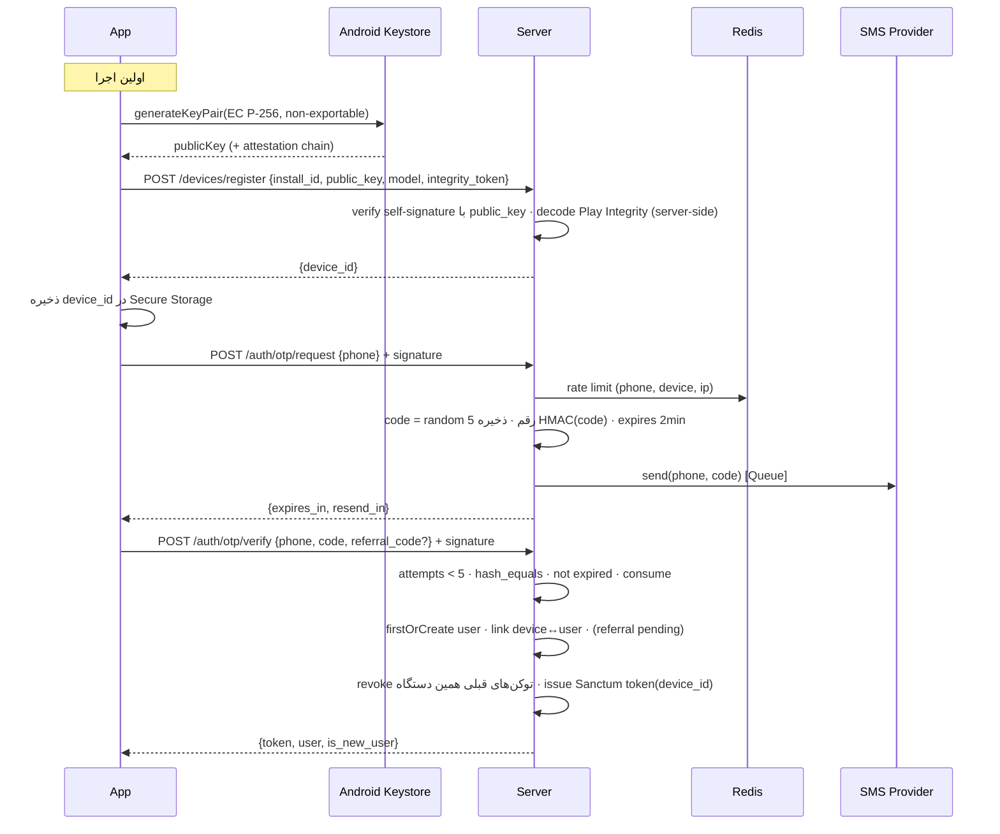
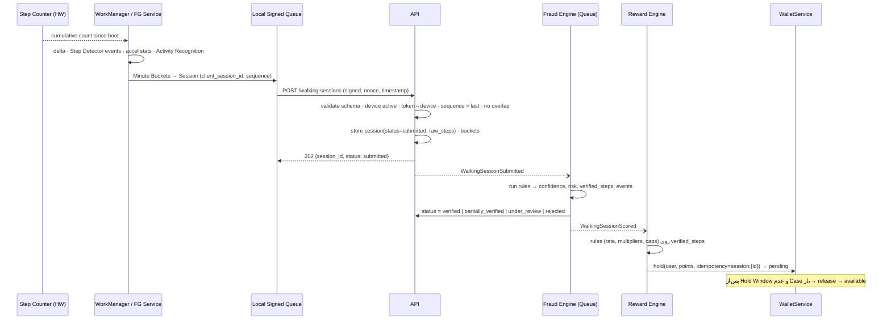
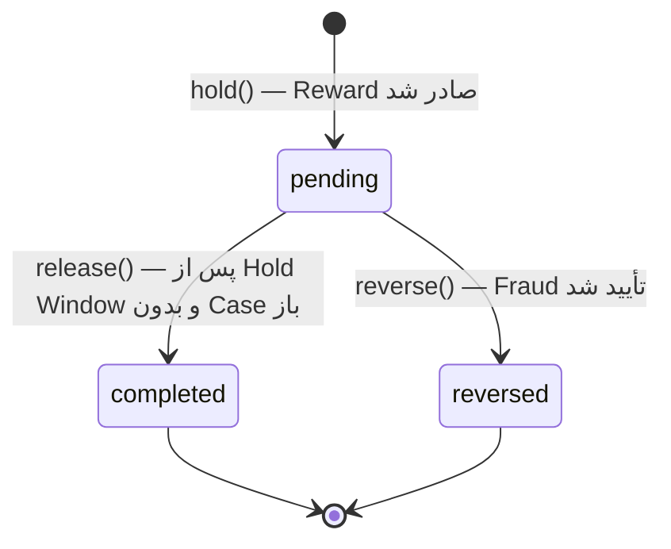
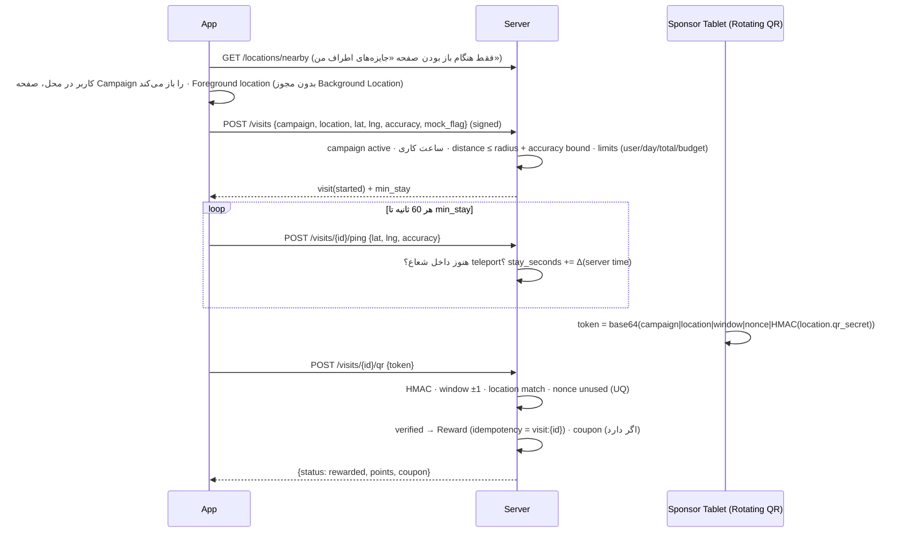

# ۵. جریان‌های اصلی

## ۵.۱ Authentication Flow



- OTP شش رقمی نه؛ **۵ رقمی** (تعادل UX و امنیت با Attempt Limit=۵ → احتمال حدس ۵/۱۰۰۰۰۰).
- کد OTP با `HMAC-SHA256(app.key, phone|code)` ذخیره می‌شود؛ دیتابیس دزدیده‌شده کد را لو نمی‌دهد.
- پاسخ `otp/request` برای شماره ثبت‌نشده و ثبت‌شده یکسان است (ضد User Enumeration).
- ساختار Auth با `AuthIdentity` قابل گسترش است؛ Email/Social در آینده یک Action جدید است، نه تغییر مدل Token.

## ۵.۲ Walking Verification Flow



- پاسخ همگام (`202`) هیچ Point ای اعلام نمی‌کند؛ Home پس از چند ثانیه با Refresh یا Push نتیجه را نشان می‌دهد. در UI اپ «قدم‌های ثبت‌شده» بلافاصله نمایش داده می‌شوند (از سنسور محلی) و «امتیاز در حال بررسی» جدا.
- **Passive sessions**: پنجره‌های پس‌زمینه (حداکثر ۶۰ دقیقه) که از خوانش دوره‌ای Step Counter ساخته می‌شوند.
- **Active sessions**: کاربر «شروع پیاده‌روی» می‌زند؛ Foreground Service + GPS اختیاری با فاصله نمونه‌برداری تطبیقی.

## ۵.۳ Anti-Fraud Flow

Fraud Engine یک **Rule Engine وزن‌دار** است. هر Rule ورودی `SessionContext` (Session، Buckets، Device، سابقه کاربر، Sessionهای همپوشان) را می‌گیرد و `RuleResult` برمی‌گرداند:

```
RuleResult { rule_key, risk_points (0..100), step_cap (nullable), hard_reject (bool), evidence }
```

ترکیب نتایج:

```
fraud_risk      = min(100, Σ weight_i × risk_i / 100)          (hard_reject → 100)
verified_steps  = min(raw_steps, min(step_cap_i)) × plausibility_factor
confidence      = 100 − fraud_risk − penalties(no integrity, no detector data, …)
status:
  risk ≥ reject_threshold (80)   → rejected        (verified_steps = 0)
  risk ≥ review_threshold (50)   → under_review    (Case در Fraud Dashboard، Reward نگه داشته می‌شود)
  step_cap اعمال شد               → partially_verified
  otherwise                      → verified
```

### Ruleهای نسخه اول (همه با params قابل تنظیم در Admin)

| key | دسته | منطق | پیش‌فرض |
|-----|------|------|---------|
| `cadence_ceiling` | motion | Cadence پایدار بیش از حد انسانی | > ۲۲۰ قدم/دقیقه در ≥۳ دقیقه → cap آن دقیقه‌ها به ۱۸۰ |
| `impossible_rate` | motion | قدم در بازه کوتاه غیرممکن | > ۲۵۰ در یک دقیقه → حذف آن دقیقه |
| `detector_mismatch` | motion | اختلاف Step Counter و Step Detector | اختلاف > ۳۵٪ → risk ۳۰ |
| `motion_signature` | motion | واریانس شتاب ناسازگار با راه‌رفتن (تکان مصنوعی: فرکانس بالا/یکنواخت) | peak_hz خارج از ۱.۲–۳.۲Hz یا std خیلی یکنواخت → risk ۴۰ |
| `metronome_pattern` | motion | Cadence بیش از حد ثابت (دستگاه تکان‌دهنده) | CV cadence < ۲٪ در ≥۱۰ دقیقه → risk ۵۰ |
| `vehicle_speed` | gps | سرعت GPS خودرویی همراه قدم | > ۳.۵ m/s با cadence پایین یا activity=in_vehicle → cap |
| `teleport` | gps | پرش مکانی غیرممکن | سرعت ضمنی > ۵۰ m/s بین دو نقطه → risk ۶۰ |
| `mock_location` | device | Flag mock از Android | risk ۷۰ |
| `integrity_verdict` | device | Play Integrity | none → risk ۳۰، unavailable → risk ۱۰ + سقف روزانه |
| `emulator_root` | device | سیگنال Client | risk ۲۰ |
| `clock_skew` | time | فاصله زمان دستگاه و سرور، Session در آینده، Session خیلی قدیمی | skew > ۵ دقیقه → risk ۲۰؛ آینده → reject؛ > ۷ روز → reject |
| `overlapping_session` | time | همپوشانی زمانی با Session دیگر همین کاربر (هر دستگاهی) | reject بخش همپوشان |
| `timezone_hop` | time | تغییر timezone غیرمنطقی | risk ۳۰ |
| `daily_physiological_cap` | account | بیش از سقف روزانه انسانی | > ۶۰٬۰۰۰ قدم/روز → cap |
| `multi_account_device` | account | تعداد حساب روی یک دستگاه | ≥ ۳ حساب در ۳۰ روز → risk ۵۰ + review |
| `multi_device_account` | account | دستگاه‌های همزمان فعال | ≥ ۳ دستگاه فعال در ۲۴ ساعت → risk ۳۰ |
| `repeat_offender` | account | سابقه Sessionهای رد شده | ≥ ۳ رد در ۷ روز → risk ۴۰ |

- Replay و دستکاری API قبل از Fraud Engine در لایه Middleware رد می‌شوند (امضا، nonce، sequence).
- هر Rule فعال یک ردیف `fraud_events` می‌سازد (فقط اگر risk>0 یا cap).
- `FraudRule` یک Interface است؛ در آینده `MlScoringRule` که یک سرویس ML خارجی را صدا می‌زند، بدون تغییر Engine اضافه می‌شود.
- **Delayed analysis** (Scheduler، قبل از آزادسازی Pending): Multi-account clustering (دستگاه/IP مشترک)، الگوی Referral، Sessionهای یکسان بین حساب‌ها.

## ۵.۴ Reward Flow

```
input: session (verified_steps, started_at, local_date, user)
1. rate      = active step_rate rule            (مثال: 1000 steps = 10 points)
2. daily     = lock daily_activities(user, local_date) FOR UPDATE
3. allowed   = min(verified_steps, max_rewarded_steps − daily.rewarded_steps)
4. base      = floor(allowed × points / steps)       (باقیمانده قدم در روز منتقل می‌شود: محاسبه روی مجموع روز)
5. mult      = Π multipliers فعال در زمان شروع Session (weekend, bonus hour, campaign) — با سقف max_multiplier
6. points    = floor(base × mult)
7. points    = min(points, daily_cap − daily.points_earned, weekly_cap − week_points)
8. rewards row (breakdown JSON) · WalletService::hold(idempotency = "walking:{session_id}")
9. goal bonus: اگر daily.verified_steps از goal عبور کرد و goal_reached_at خالی است → hold("goal:{user}:{date}")
```

محاسبه base روی **مجموع روز** انجام می‌شود (`points_for(total_rewarded_steps) − points_already_from_steps`) تا گرد کردن در Sessionهای کوچک باعث از دست رفتن Point نشود.

## ۵.۵ Wallet Flow



هر عملیات در یک DB Transaction:

```php
DB::transaction(function () {
    $wallet = Wallet::whereKey($userId)->lockForUpdate()->first();
    // idempotency: اگر (user_id, key) وجود دارد → همان را برگردان
    // insert point_transactions (balance_before, balance_after)
    // update wallets
});
```

- **debit** (خرید): `available_balance >= amount` زیر قفل بررسی می‌شود؛ `CHECK` دیتابیس لایه دوم دفاع است.
- **adjustment** (Admin): فقط از طریق `WalletService::adjust(admin, amount, reason)`؛ reason اجباری؛ Audit Log.
- **expiration**: Scheduler با تراکنش `expiration` منفی (اگر سیاست انقضا فعال باشد — پیش‌فرض خاموش).
- ارزش ریالی: `available_balance × current_rate`. هر Transaction `rial_rate` لحظه خودش را دارد.

## ۵.۶ Sponsored Location Flow



- زمان حضور با **ساعت سرور** اندازه‌گیری می‌شود، نه ادعای Client.
- دقت GPS بد (accuracy > 100m) → درخواست تلاش مجدد، نه Reward.
- بودجه Sponsor به‌صورت اتمیک کسر می‌شود (`UPDATE campaigns SET points_spent = points_spent + ? WHERE points_spent + ? <= point_budget`).

## ۵.۷ Store Purchase Flow

```
POST /orders  {items, address_id?, payment_mode}  Idempotency-Key: <uuid>
1. Order موجود با همین (user, idempotency_key)؟ → همان را برگردان (200)
2. DB::transaction:
   a. products lockForUpdate (به ترتیب id برای جلوگیری از Deadlock)
   b. status=active · stock کافی · max_per_user
   c. total_points = Σ unit_point_price × qty (از DB، نه از Client)
   d. WalletService::debit(user, total_points, idempotency="order:{order_public_id}")
      → InsufficientPoints → rollback → 409
   e. stock -= qty (شرطی: WHERE stock >= qty)
   f. order(status=paid) · items(snapshot)
   g. دیجیتال: assign product_code (lockForUpdate, SKIP LOCKED) → delivered
3. afterCommit: OrderPlaced event → notification · analytics
```

- Point + Money: Order در `pending` با Hold کردن Point؛ پس از Callback موفق درگاه → `paid`. عدم پرداخت در ۱۵ دقیقه → آزادسازی Hold (Refund transaction).
- Cancel/Refund: تراکنش `refund` مثبت با idempotency `refund:{order}`؛ stock برمی‌گردد.
