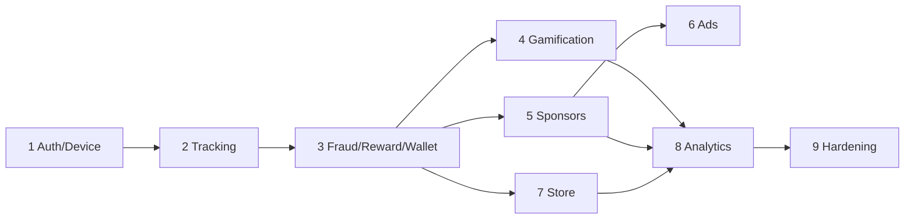

# ۹. Implementation Roadmap

هر Phase فقط وقتی «تمام» است که: Migration · Model · API · Backend logic · Flutter · Test · مستند آن کامل باشد.

| Phase | محتوا | خروجی کلیدی | وضعیت |
|-------|-------|-------------|-------|
| 0 | Architecture، ERD، API، Flows، Security، Tracking، Design System | این پوشه | ✅ |
| 1 | Auth (OTP)، Profile، Device registration + Request signing، Settings/Feature flags، Config API، Audit log، Admin foundation، پایه Flutter (Design system، Network، Storage، Router، Onboarding، Auth، Shell، Home اولیه، Profile) | [phase-1.md](../phase-1.md) | ✅ |
| 2 | Step tracking (Kotlin sensor channel + WorkManager)، Walking sessions API، Offline queue، Daily activity، Calories، Activity timeline | [phase-2.md](../phase-2.md) | ✅ |
| 3 | Fraud Engine + Rules، Verified steps، Reward Engine، Point Ledger، Wallet، Pending release scheduler، Fraud cases پایه | [phase-3.md](../phase-3.md) | ✅ |
| 4 | Health dashboard، Water tracker، XP/Level، Achievements، Streak، Leaderboard (Redis)، Challenges، Weekly report، Referral، Notifications | [phase-4.md](../phase-4.md) | ✅ |
| 5 | Sponsors، Locations، Campaigns، Visits (Geofence + Stay + Rotating QR)، Coupons، Sponsor Panel | [phase-5.md](../phase-5.md) | ✅ |
| 6 | Advertising: Placement، Internal ads، Provider adapters (Yektanet/AdSell پس از بررسی مستندات رسمی)، Rewarded S2S | | ⏳ |
| 7 | Store، Products، Orders، Point purchase (Atomic)، Addresses، Payment adapter (Flag) | | ⏳ |
| 8 | Admin analytics، Sponsor analytics، Fraud dashboard کامل، Reports، Support tickets، CMS | | ⏳ |
| 9 | Security hardening (Cert pinning، Admin 2FA، Key rotation)، Performance (Partitioning، Horizon)، Load test، Deployment (Docker، CI) | | ⏳ |

## وابستگی‌ها

## ریسک‌ها

| ریسک | کاهش |
|------|------|
| نبود Google Play Services روی بخشی از دستگاه‌ها | Integrity «unavailable» فقط سیگنال است؛ سقف Reward کمتر برای آن دستگاه‌ها |
| Kill شدن Worker توسط OEM | Counter تجمعی سخت‌افزاری؛ فقط Sync دیر می‌شود |
| SDK تبلیغاتی بدون S2S | Rewarded ad برای آن Provider غیرفعال |
| تقلب سازمان‌یافته (مزرعه گوشی) | Hold window، Multi-account clustering، سقف روزانه، Fraud dashboard |
| هزینه اقتصادی Point | نرخ تبدیل و سقف‌ها از Admin؛ داشبورد Points issued/spent |
